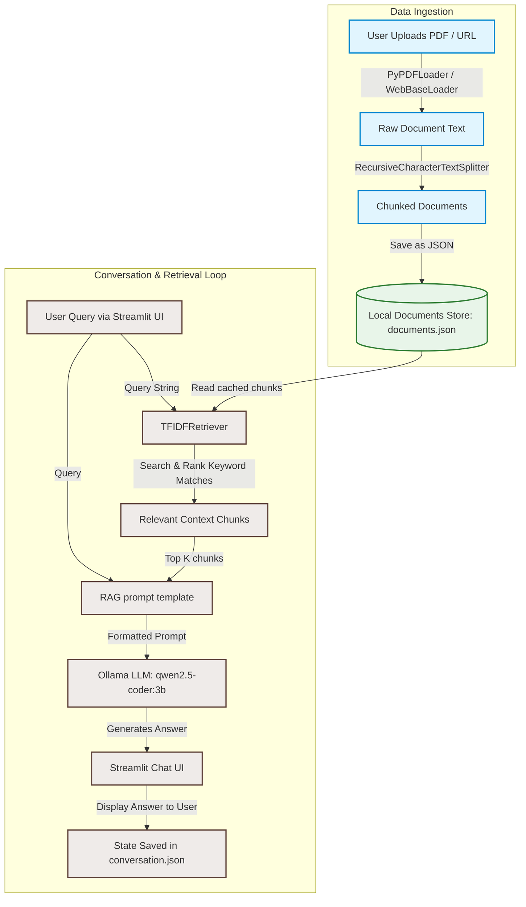

# 🤖 Your Friendly Neighbourhood AI Study Assistant 📄

A 100% local, privacy-focused **Retrieval-Augmented Generation (RAG)** chatbot designed to help you interact with your study materials, PDF documents, and web pages. Ask questions in natural language, and get instant, context-aware answers based on the actual contents of your uploads.

---

## ✨ Features

- 📄 **Multi-PDF Upload**: Drop one or multiple study guides, textbooks, or notes.
- 🌐 **Web URL Ingest**: Parse and extract content from online articles or blog posts.
- 🚀 **100% Offline & Local**: Runs entirely on your local machine using **Ollama** and **Streamlit**—no data ever leaves your computer.
- 🔍 **Robust Local Retrieval**: Employs an offline keyword-based TF-IDF search index. This design:
  - Bypasses Ollama embedding endpoint constraints (e.g., `501 Not Supported` errors).
  - Eliminates the need to download large embedding model weights (like HuggingFace models) over the internet.
  - Runs blazing fast on any CPU with zero network dependency.
- 💾 **Persistent Chat Sessions**: Automatically saves conversation history locally to survive browser refreshes.

---

## 🏛️ System Architecture

The following diagram illustrates how raw documents are ingested, parsed, indexed, and retrieved to feed context into the local LLM.



### Components Breakdown:
*   **Chat UI (`src/chat_ui.py`)**: A modern web dashboard built with Streamlit utilizing chat bubbles for smooth visual flows. Handles sidebar controls, file uploading, URL entry, and chat resetting.
*   **LLM RAG Handler (`src/llm_rag.py`)**: Manages the orchestration of conversation history, templates prompts dynamically, triggers document retrieval, and connects with the LLM.
*   **Document Index Store (`src/vector_store.py`)**: An offline-first local index that parses files, splits them into manageable chunks using a `RecursiveCharacterTextSplitter`, and implements the fallback keyword-based `TFIDFRetriever`. Chunked documents are saved under `faiss_index/documents.json`.
*   **Conversation Manager (`src/conversation.py`)**: Serializes the list of chat messages to a local cache to preserve state when reloading the browser.

---

## 🛠️ Step-by-Step Installation

### Prerequisites
1. **Python 3.11.15** (Recommended version)
2. **Ollama** installed on your system.

---

### Step 1: Install Ollama & Pull the Model
Download and install [Ollama](https://ollama.com). Open your terminal/command prompt and run:

```bash
# Pull the lightweight, high-performance coder model
ollama pull qwen2.5-coder:3b
```

Ensure Ollama is running in the background before starting the Streamlit application.

---

### Step 2: Clone the Repository
```bash
git clone https://github.com/your-username/rag-chatbot.git
cd rag-chatbot
```

---

### Step 3: Setup Virtual Environment & Install Dependencies

#### Option A: Using `uv` (Fastest)
If you have `uv` installed, run:
```powershell
# Create venv
uv venv --python 3.11.15

# Activate environment
.venv\Scripts\activate

# Install requirements
uv pip install -r requirements.txt
```

#### Option B: Using standard Python
```powershell
# Create venv
python -m venv .venv

# Activate environment
.venv\Scripts\activate

# Install requirements
pip install -r requirements.txt
```

---

### Step 4: Run the Application
Start the Streamlit application using:
```bash
streamlit run src/chat_ui.py
```

Open `http://localhost:8501` in your browser.

---

## 🐋 Running with Docker

You can build and run this application inside a Docker container.

1. **Build the Docker Image**:
   ```bash
   docker build -t study-assistant .
   ```

2. **Run the Container**:
   ```bash
   docker run -p 8501:8501 study-assistant
   ```

Note: If running Docker on Windows/macOS and you want it to access your host machine's Ollama instance, ensure you use `http://host.docker.internal:11434` for Ollama connection configurations.

---

## 📂 Project Structure

```
├── Dockerfile              # Container configuration file
├── README.md               # Project documentation
├── requirements.txt        # Project dependencies
├── resources/              # Directory for example documents
│   └── Project ATLAS.pdf   # Example PDF document
└── src/
    ├── chat_ui.py          # Main Streamlit user interface
    ├── conversation.py     # Session persistence manager
    ├── llm_rag.py          # Orchestrates LangChain components & Ollama
    └── vector_store.py     # Local offline indexing and retrieval
```
